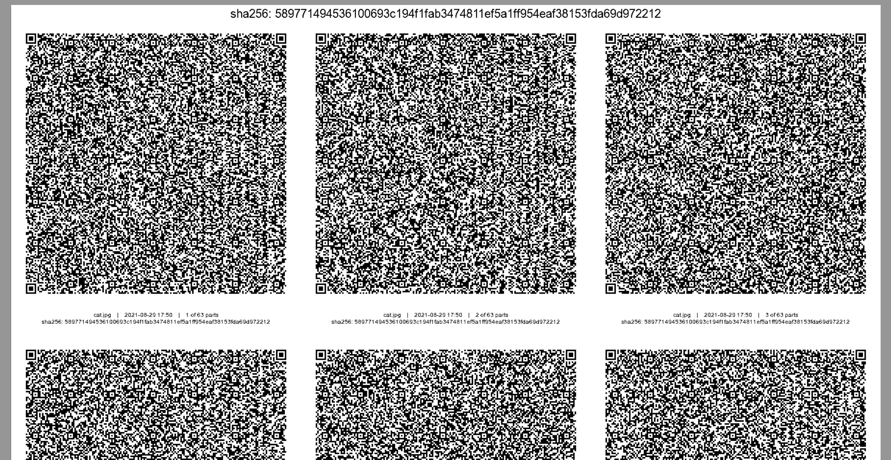

# Papiro

**Papiro encodes and decodes files to/from QR Code(s).**

You can encode a single file or a full directory, in the latter case the data are zipped before the encoding.

The QR Codes are saved in a single (eventually multi page) pdf, ready to print; the rebuild process is done on a group of QR Codes' photos. Papiro is useful to save files in a non digital fashion for backup and portability pourposes using a printer.
You can encode passwords, secrets, credentials, 2FA backup codes, crypto seeds ([mind the privacy](#privacy--encryption)!) and any text/binary file.

_Papiro_ is the italian word for "papyrus" :page_with_curl:

## Why QR Codes on paper?

Because paper seems the [most resilient and cost-effective storage medium on earth](https://superuser.com/questions/374609/what-medium-should-be-used-for-long-term-high-volume-data-storage-archival), at least for low volume data, and QR Codes have an interesting error-checking system. So it is a nice backup solution to pair with digital ones.

## Specs & Performances

Papiro uses the QR Code v40 (177x177 matrix) with low (default, you can change it with the -l option) error correction level; [according to the specs](https://www.qrcode.com/en/about/version.html) with this config we can save 2953 bytes in binary mode on a single QR Code. An A4 sheet can accomodate 12 QR Codes for *an unbelievable total of ~34.60KB!* So a standard 500 sheets pack easily stores ~16.89MB, or ~33.79MB with an double side print.
With the best (high) error correction level you can print ~14.91KB/sheet.

## Requirements

Papiro is a simple shell script and needs these binaries:

- `convert`
- `qrencode`
- `zbarimg`
- `montage`

### Linux

Install the required binaries using your favorite package manager, e.g.:

```
apt-get install imagemagick
apt-get install qrencode
apt-get install zbar-tools # Can have a different name, eg. "zbar"
```
If you get an error on Linux about the *"convert: attempt to perform an operation not allowed by the security policy <gs|pdf>"* add the following to */etc/ImageMagick-7/policy.xml*:

```
<policy domain="coder" rights="read | write" pattern="PDF" />
<policy domain="coder" rights="read | write" pattern="gs" />
```

### Mac

Install the required binaries using [brew](https://brew.sh):

```
brew install imagemagick
brew install qrencode
brew install zbar
```

### Windows

I don't own a Windows PC, sorry; so any contributions are welcome to test Papiro and write a brief startup guide. Fork the project and create a pull request, thank you!

## Installation

Clone the repo and make the script executable:

```
 git clone https://github.com/dtonon/papiro.git
 cd papiro
 chmod +x papiro.sh
 ./papiro.sh -h
 ```
 You can even [download/copy](https://raw.githubusercontent.com/dtonon/papiro/master/papiro.sh) the single `papiro.sh` file and make it executable, that's all!

 ## Usage

```
# Encode a file to QR Codes in single pdf
./papiro.sh -c memo.txt

# Zip and encode a file
./papiro.sh -c divina-commedia.txt -z

# Encode a file with the best error correction
./papiro.sh -c important-data.xml -lH

# Encode a directory to qrcodes (using a zip file)
./papiro.sh -c mydata/

# Interactively create a new vim encrypted file and then process it
./papiro.sh -x

# Encode a file to QR Codes keeping the filename secret
./papiro.sh -c cat.jpg -a

# Decode a group of images to rebuild a file
# Note: files have to be correctly ordered by name,
# cameras create sequential pics with a correct filename
./papiro.sh -r photos/ -o data.json
```
Papiro options:

```
-z	Zip the file(s)
-l	Set the QR Code error correction level (L|M|Q|H); default is L(ow)
-o	Set the output filename
-a	Anonymous mode, don't annotate the original filename
-s	Create a papiro of the script itself, useful for archiving along with the encoded data
-h	Show the help
-d	Debug mode, create a debug/ dir with the temp images
```

## Example

In the examples/ dir you can find a [nice 60KB cat's photo](examples/cat/cat.jpg) and the [2 pages QR Codes-pdf-papiro](examples/cat/qrcodes-cat.jpg.pdf) generated with the following command:

```
./papiro.sh -c cat.jpg
```
This is a preview of the generated pdf (top cropped A4 page):

[](examples/cat/qrcodes-cat.jpg.pdf)

Or you can enjoy the full [Divina Commedia in 7 pages](examples/divina-commedia/README.md) or [Moby-Dick in 15 pages](examples/moby-dick/README.md), too!

## Privacy & Encryption

Remember that a QR Code obfuscates your data but it does not protect them in any way; if your data need privacy you *have* to encrypt them before using Papiro. This is also useful to avoid the [printer's attack surface](https://krebsonsecurity.com/2021/07/microsoft-issues-emergency-patch-for-windows-flaw/). To apply a good privacy layer you can use [GPG](https://gnupg.org/), a password protected zip (also useful to reduce the file size and so the number of QR Codes) or the built-in "new vim encrypted file":

```
./papiro.sh -x
```

You can also use the `-a` (*Anonymous*) option to don't annotate the filename on the created pdf.

## Self mode
You can create a papiro of papiro.sh itself using the -s flag:

```
./papiro -s
```
This command encode the script in QR codes with a brief description about how to decode and use it; it is useful to include with the encoded data, to ensure a easy way to decode it even if your don't have the original Papiro script and are using an air gapped system.