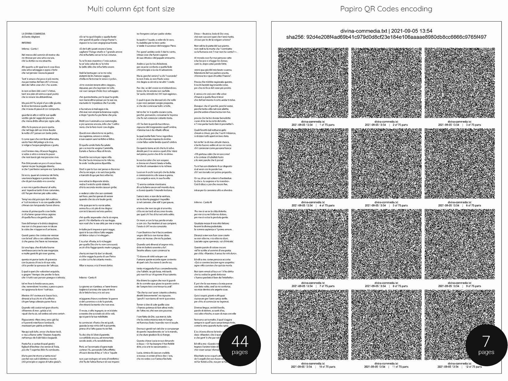

# Print the Divina Commedia in just 7 pages

With [Papiro](https://github.com/dtonon/papiro) you can print the full [Divina Commedia](divina-commedia.txt) by Dante Alighieri (19.567 lines for 557KB of plain text) in [just 7 pages](qrcodes-divina-commedia.txt.pdf). It is easy:

```
./papiro.sh -z -c divina-commedia.txt
```

About 44 pages would be required to print it with a 6pt font size (average minimum readeable size, while for an good OCR should be at least 9pt) in a multi column document, without taking advantage of any error correction. Spot the differences:



Ok, you can't read it at a glance, but has a nice nerd factor :)

If you are a real paranoid archivist feel free to increase the error correction level, but you have to invest [even 15 pages](qrcodes-h-level-divina-commedia.txt.pdf):

```
./papiro.sh -z -c divina-commedia.txt -lH
```
Expensive, but suitable for a military-grade disaster recovery plan for italian literature.