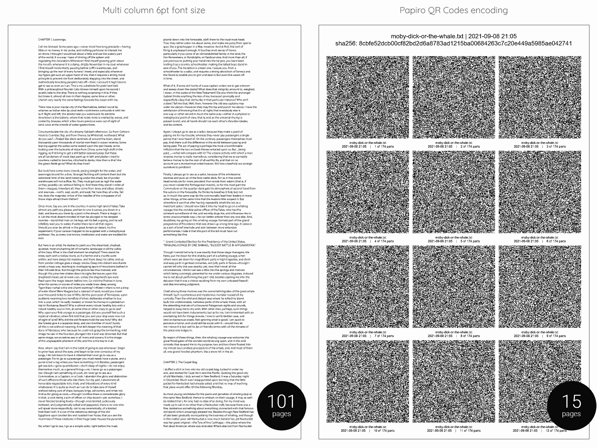

# Print Moby-Dick in just 15 pages

With [Papiro](https://github.com/dtonon/papiro) you can print the full [Moby-Dick](moby-dick.txt) by Herman Melville (22.314 lines / 1,3MB plain text) in [just 15 pages](qrcodes-moby-dick.txt.pdf). It is easy:

```
./papiro.sh -c moby-dick.txt -z
```

About 101 pages would be required to print it with a 6pt font size (average minimum readeable size, while for an good OCR should be at least 9pt) in a multi column document, without taking advantage of any error correction. Spot the differences:



Ok, you can't read it at a glance, but has a nice nerd factor :)

If you are a real paranoid archivist feel free to increase the error correction level, but you have to invest [even 34 pages](qrcodes-h-moby-dick.txt.pdf):

```
./papiro.sh -c moby-dick.txt -z -lH
```
Expensive, but suitable for a military-grade disaster recovery plan for the Great American Novel.